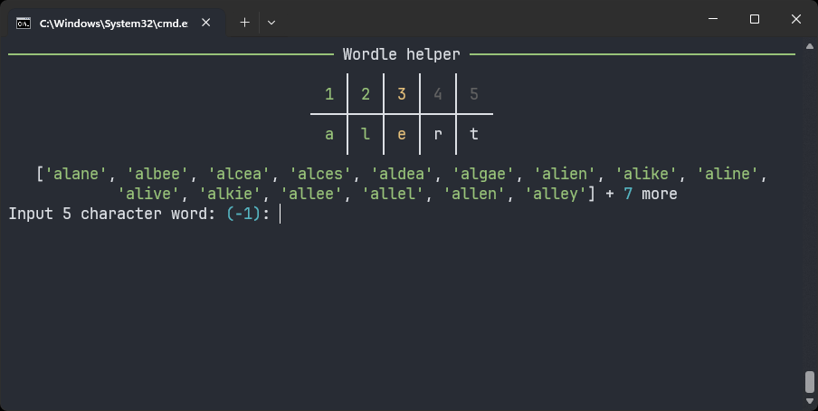
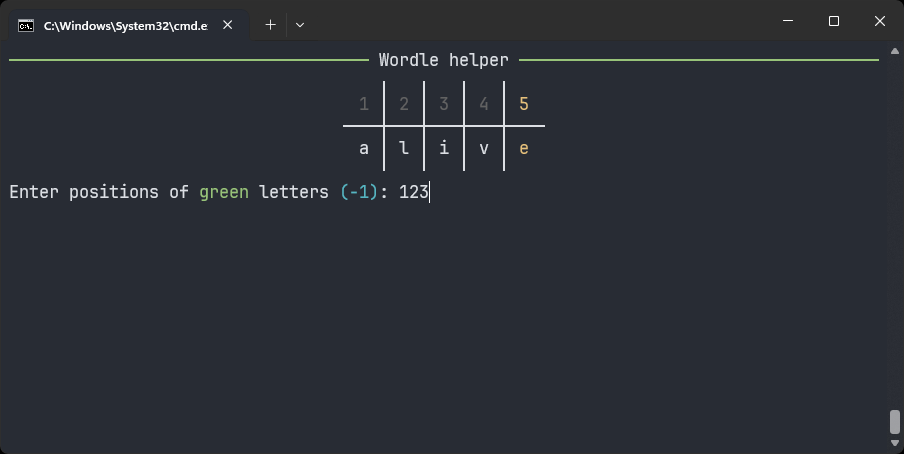
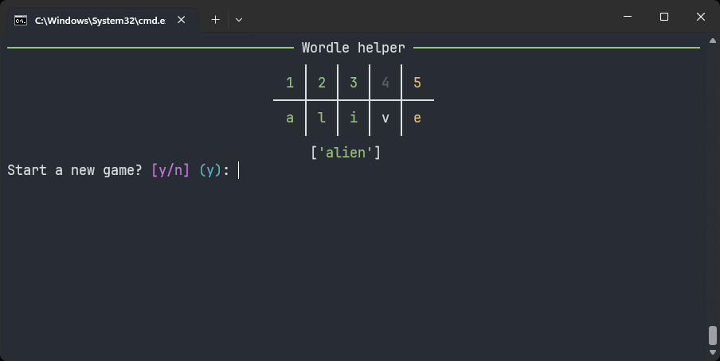

# Wordler

Wordler is a terminal program designed to help solve Wordle puzzles.
Textualize [rich](https://github.com/Textualize/rich) library is used for a better user experience.

- Filter words based on green, yellow, and gray letters.
- Interactive console prompts for user input.

# Screenshots





## Installation

Clone the repository:

```sh
git clone https://github.com/TMotDev/wordler.git
cd wordler
```
Install the required dependencies:


```sh
python -m pip install rich
```

Usage

To run the program, execute the main.py file:

```sh
python main.py
```

### Files

- `main.py`: The main entry point of the program.
- `wordleFilter.py`: The module with the filtering logic.
- `words.txt`: A list of five-letter words.
